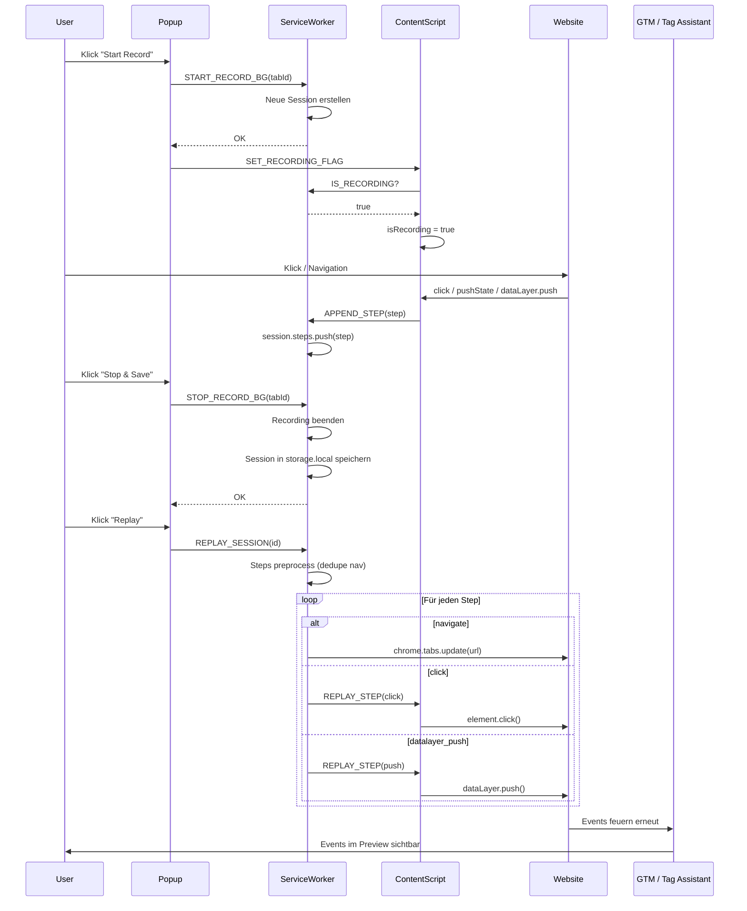

## Technische Architektur – Sequenzdiagramm

```mermaid
sequenceDiagram
    participant User
    participant Popup
    participant ServiceWorker
    participant ContentScript
    participant Website
    participant GTM as GTM / Tag Assistant

    User->>Popup: Klick "Start Record"
    Popup->>ServiceWorker: START_RECORD_BG(tabId)
    ServiceWorker->>ServiceWorker: Neue Session erstellen
    ServiceWorker-->>Popup: OK

    Popup->>ContentScript: SET_RECORDING_FLAG
    ContentScript->>ServiceWorker: IS_RECORDING?
    ServiceWorker-->>ContentScript: true
    ContentScript->>ContentScript: isRecording = true

    User->>Website: Klick / Navigation
    Website->>ContentScript: click / pushState / dataLayer.push
    ContentScript->>ServiceWorker: APPEND_STEP(step)
    ServiceWorker->>ServiceWorker: session.steps.push(step)

    User->>Popup: Klick "Stop & Save"
    Popup->>ServiceWorker: STOP_RECORD_BG(tabId)
    ServiceWorker->>ServiceWorker: Recording beenden
    ServiceWorker->>ServiceWorker: Session in storage.local speichern
    ServiceWorker-->>Popup: OK

    User->>Popup: Klick "Replay"
    Popup->>ServiceWorker: REPLAY_SESSION(id)

    ServiceWorker->>ServiceWorker: Steps preprocess (dedupe nav)
    loop Für jeden Step
        alt navigate
            ServiceWorker->>Website: chrome.tabs.update(url)
        else click
            ServiceWorker->>ContentScript: REPLAY_STEP(click)
            ContentScript->>Website: element.click()
        else datalayer_push
            ServiceWorker->>ContentScript: REPLAY_STEP(push)
            ContentScript->>Website: dataLayer.push()
        end
    end

    Website->>GTM: Events feuern erneut
    GTM->>User: Events im Preview sichtbar
```